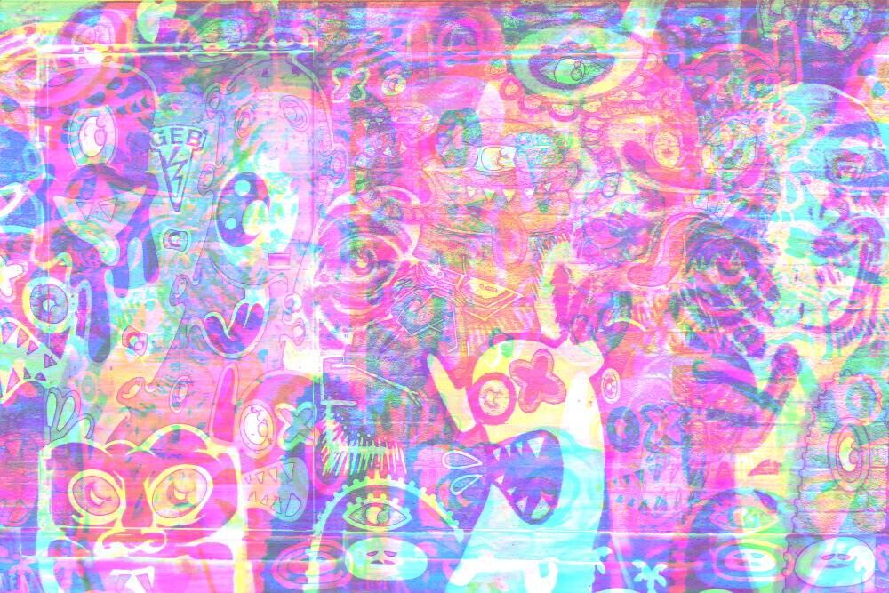
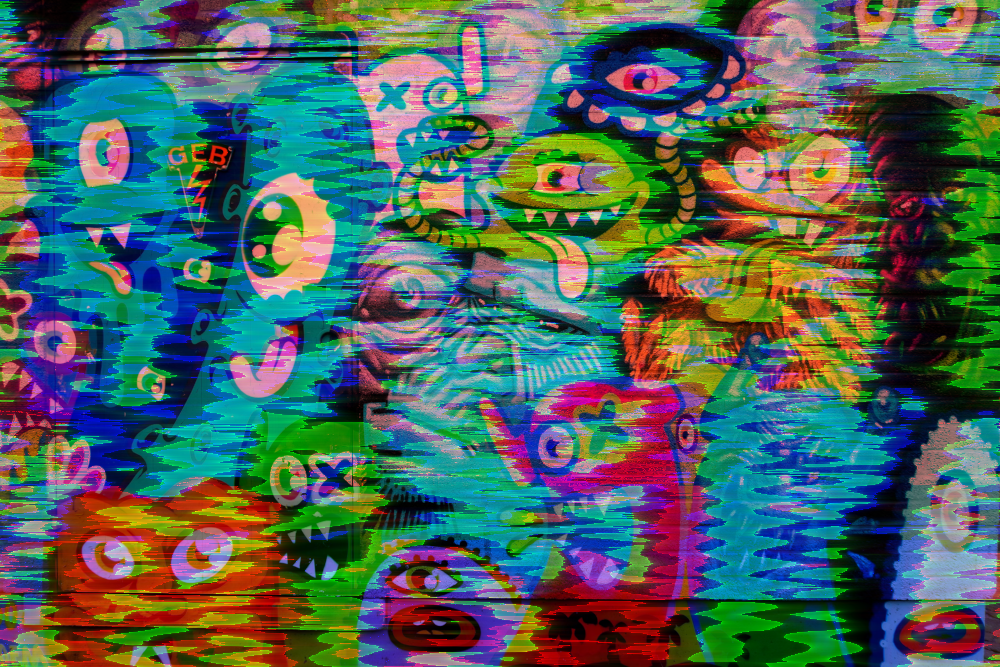
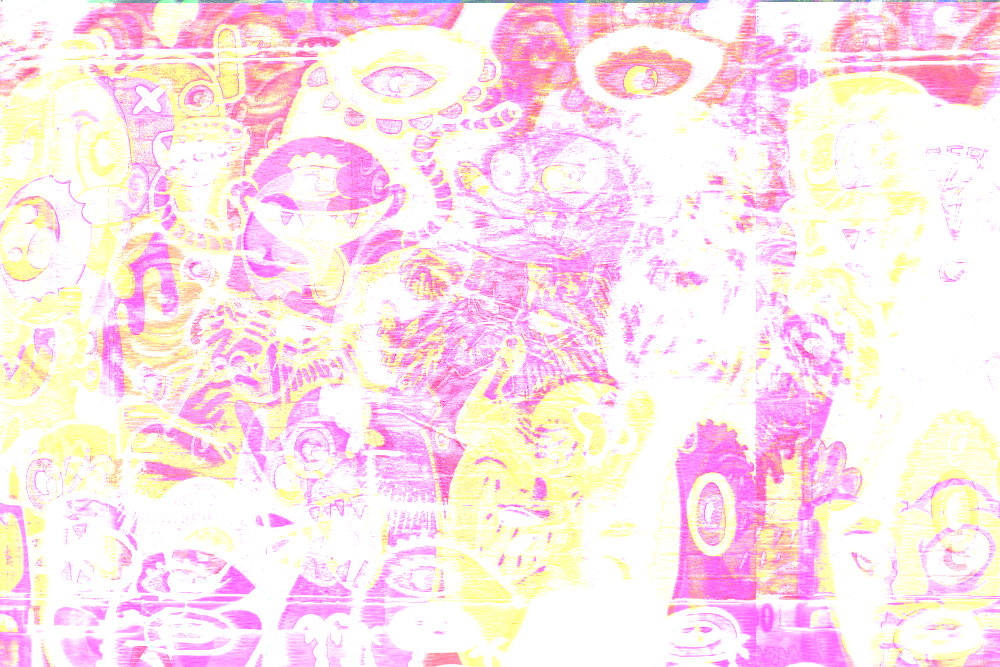

An example of an image that was databent using my [web-based databending application](https://handeyeco.github.io/databend/).

# Databending with Web APIs

This repo hosts this blog post and a simplied example:

- [Source](https://github.com/handeyeco/databend-blog)
- [Demo](https://handeyeco.github.io/databend-blog/)

It's based on the work for a web application that builds a UI around this concept:

- [Source](https://github.com/handeyeco/databend)
- [Application](https://handeyeco.github.io/databend/)

## Intro

[Databending](https://en.wikipedia.org/wiki/Databending), like circuit bending, is a way of creatively breaking technology to generate unique and unexpected results. In circuit bending the idea is to mess around with the underlying electronics: modding, jumping, and shorting to find interesting ways to break circuits. In databending the idea is to break things in the data layer.

Computers operate in 1s and 0s. We might see an "a" in a text file, but a computer will see "01100001". The fact that we're just dealing with numbers is important to databending: when we run an audio file through an EQ or an image through a filter, we might think the application has some sense for what a song or a picture is, but ultimately it's just doing math. So what happens when we run an image through an EQ? Or an audio file through an image filter? That's one sure-fire way to break things!

A common example of databending (and how I learned about it) was taking the free audio software [Audacity](https://www.audacityteam.org/), using its "raw data" import option to load in an image, running some audio effects over the image, and exporting the bits back out as an image file. Here's an example of an image bent with Audacity ([original image source](https://unsplash.com/photos/green-and-yellow-abstract-painting-WKQt_X-SKFI); [Audacity databending tutorial](https://www.youtube.com/watch?v=cXjwJPz4qi0)):



It's fairly easy to do, but it's also fairly easy to do irrepairable damage to the image file. That's because in most files there's a section of the bits devoted to the data and there's a section of the bits devoted to metadata (the header). Running the header through the databending process can result in a file that can't be opened. Applications for reading the file can't understand the metadata at a certain point.

It's also a long-ish iteration cycle. Audacity isn't showing a preview of the image you're destroying because it doesn't even know it's working with an image; Audacity is just doing math with a bunch of bits you handed it.

## The thing I made

As a kid I enjoyed breaking photos with Audacity to make pseudo-generative art and then I became a web developer; so I decided to make my own app. In modern browsers we have a few tools that are relevant to this project:

1. [Canvas API](https://developer.mozilla.org/en-US/docs/Web/API/Canvas_API): an API for working with images
2. [Web Audio API](https://developer.mozilla.org/en-US/docs/Web/API/Web_Audio_API): an API for working with audio
3. [Tone.js](https://tonejs.github.io/): a library that takes the very low-level building blocks from the Web Audio API and abstracts them into higher-level audio tools (like BitCrusher and PitchShift).

With these tools, I made the [databend](https://github.com/handeyeco/databend) project. It uses the Canvas API to convert an image into a bunch of numbers, runs the numbers through different audio effects provided by Tone.js, and then converts the resulting audio data back into an image.

It doesn't muck with the headers because it's just manipulating the actual image/audio data. Also it's aware of the fact that its job is to destroy images, so it provides some previews of how the image will look on the other side of the process.

## How it works

This is just going to focus on the databending pieces and not the web application surrounding that logic. I also don't guarantee this will be working code; this will just be to get the idea across. The actual code can be found in the [Github repo](https://github.com/handeyeco/databend).

### From image to audio

The first step is getting image data. We do this by creating a Canvas context, rendering an image with it, and then pulling out the image data.

```JS
// pretend you have an image object
// like by using `new Image()`
const { width, height } = image
const canvas = document.createElement('canvas')
const context = canvas.getContext('2d')
context.drawImage(image, 0, 0, width, height)
// This is confusing: getImageData returns an object
// containing a property called data
const imageDataContainer = context.getImageData(0, 0, width, height)
const imageData = imageDataContainer.data
```

([getContext](https://developer.mozilla.org/en-US/docs/Web/API/HTMLCanvasElement/getContext), [drawImage](https://developer.mozilla.org/en-US/docs/Web/API/CanvasRenderingContext2D/drawImage), [getImageData](https://developer.mozilla.org/en-US/docs/Web/API/CanvasRenderingContext2D/getImageData))

So what do you have at this point? You're now the proud owner of a `Uint8ClampedArray` representing the image. It's a 1D array that describes each pixel with four values: red, green, blue, and alpha (transparency). Each value is represented as a number between 0 and 255. So one pixel of opaque [steelblue](https://www.color-hex.com/color/4682b4) and one pixel of fully transparent [salmon](https://www.color-hex.com/color/fa8072) would be:

```
// R, G, B, A, R, G, B, A
[70, 130, 180, 255, 250, 128, 114, 0]
```

Audio works with floats between -1 and 1, so we need to do a conversion:

```JS
function scale (number, inMin, inMax, outMin, outMax) {
    return (number - inMin) * (outMax - outMin) / (inMax - inMin) + outMin;
}

const audioData = new Float32Array(imageData.length)
for (let i = 0; i < imageData.length; i++) {
    audioData[i] = scale(imageData[i], 0, 255, -1, 1)
}
```

### Through Tone.js

I didn't say this earlier, but thank you to the maintainers of and contributors to Tone.js. It's just a gem of a library.

At this point we have a Float32Array that looks enough like audio that we can pass it to Tone.js. The application code gets a little convoluted here because I wrap each Tone.js module in a wrapper that allows me to apply a dry/wet mix.

I also add an option to split the color channels before running it through Tone.js: remember that the array is sorted as [R, G, B, A], this option creates four arrays ([R], [G], [B], [A]), runs them individually through the audio effects, and then merges them again on the other side. It's hard to explain this, but think about a delay: a delay takes information from one position in the array and applies it to another position. By processing all the colors together, information from the red color might affect the blue color or alpha numbers. By splitting them, red will only affect red. Also it gives me the ability to only apply the effect to one color at a time.

Anyway some mock code to (hopefully) make this step clearer (without the dry/wet mix or split logic):

```JS
const audioContext = Tone.getContext()

// Create offline renderer so we don't have to wait for the "audio" to "play"
// before we get a buffer back that we can either manipulate more or convert to an image
const rendered = await Tone.Offline(() => {

    // Create a one channel buffer that will store the "audio" data we made
    const buffer = audioContext.createBuffer(1, audioData.length, audioContext.sampleRate)
    const buffering = buffer.getChannelData(0)

    // Fill the buffer with our data
    for (let i = 0; i < audioData.length; i++) {
        buffering[i] = audioData[i]
    }

    // Create the Tone buffer module to play the audio data
    const bufferNode = new Tone.ToneBufferSource(buffer)
    // Create the Tone feedback delay module to manipulate the audio data
    const delay = new Tone.FeedbackDelay({
        delayTime: 0.2,
        feedback: 0.5
    })

    // Connect the nodes to each other and then to the audio output
    bufferNode.connect(delay)
    delay.toDestination()

    // Start playback of the buffer
    bufferNode.start()

}, audioData.length / audioContext.sampleRate, 1, audioContext.sampleRate)

// Pull the raw data out of the buffer
const processedAudioData = rendered.getChannelData(0)
```

([Tone.getContext](https://tonejs.github.io/docs/14.7.77/fn/getContext), [Tone.Offline](https://tonejs.github.io/docs/14.7.77/fn/Offline), [Tone.ToneBufferSource](https://tonejs.github.io/docs/14.7.77/ToneBufferSource), [Tone.FeedbackDelay](https://tonejs.github.io/docs/14.7.77/FeedbackDelay), [Tone.toDesination](https://tonejs.github.io/docs/14.7.77/Destination), [createBuffer](https://developer.mozilla.org/en-US/docs/Web/API/BaseAudioContext/createBuffer), [getChannelData](https://developer.mozilla.org/en-US/docs/Web/API/AudioBuffer/getChannelData), [connect](https://developer.mozilla.org/en-US/docs/Web/API/AudioNode/connect))

Steps:

- Since we don't actually want to listen to the audio, we create an offline Tone instance. Besides saving us from harsh noise, it also speeds up the process since it can run as fast as possible to render audio (rather than have to play the audio at a normal speed).
- We create a [Web Audio API buffer](https://developer.mozilla.org/en-US/docs/Web/API/AudioBuffer) and populate it with the data we generated in the image-to-audio step.
- We create a Tone.js ToneBufferSource (using the Web Audio buffer) and FeedbackDelay, connect than, and start the buffer playing.
- Tone.Offline returns a promise containing the buffer containing the data we'll convert back into an image.
- Once it's all processed, we pull out the raw data from the buffer: another Float32Array.

This is where the bulk of the experimentation happens. Here you can tweak the settings for the FeedbackDelay or replace it with a series of other Tone.js modules (I highly recommend the Chebyshev waveshaper). For each new module, just make an instance using the constructor and add connections using `.connect`. Dig through the code to see how I added dry/wet mixes and the option to process individual colors.

### From audio to image

From here we'll scale the audio data (from -1 to 1) back to image data (from 0 to 255) and drop the updated pixels back into the Canvas context:

```JS
for (let i = 0; i < processedAudioData.length; i++) {
    // This is the same imageData as above, we're just overwriting the array
    imageData[i] = scale(processedAudioData[i], -1, 1, 0, 255)
}

// Dump the data back into the Canvas context
context.putImageData(imageDataContainer, 0, 0)
```

([putImageData](https://developer.mozilla.org/en-US/docs/Web/API/CanvasRenderingContext2D/putImageData))

Here's the same image databent by playing with the demo code:



## Conclusion

This isn't the most performant way to do this. It's laggy and front-end JavaScript is probably the last place we want to be processing large numbers of bits. I'm sure WASM or Web Workers or C++ would be a better alternative. I am glad I made this though; it highlights how far web APIs have come and how many tools we have available to us on the front-end. Plus I used this to make art that landed me on the cover of a zine I admire!

Anyway, hope this helps someone. Happy hacking!
